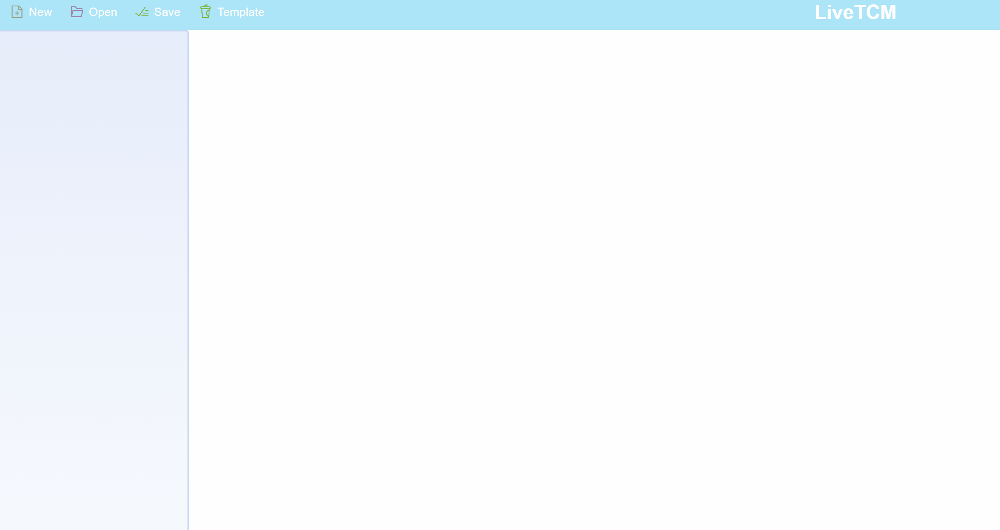
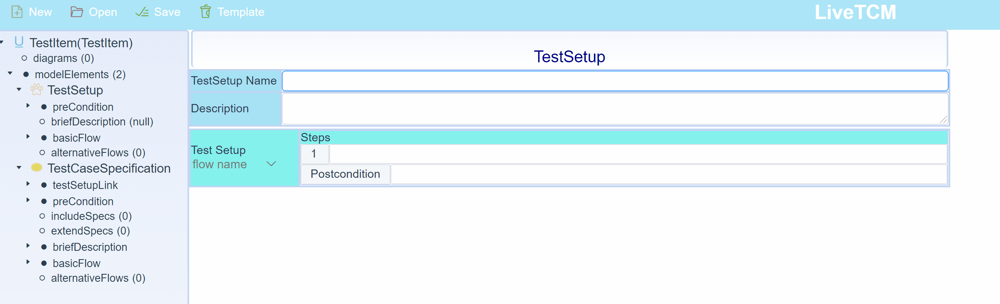
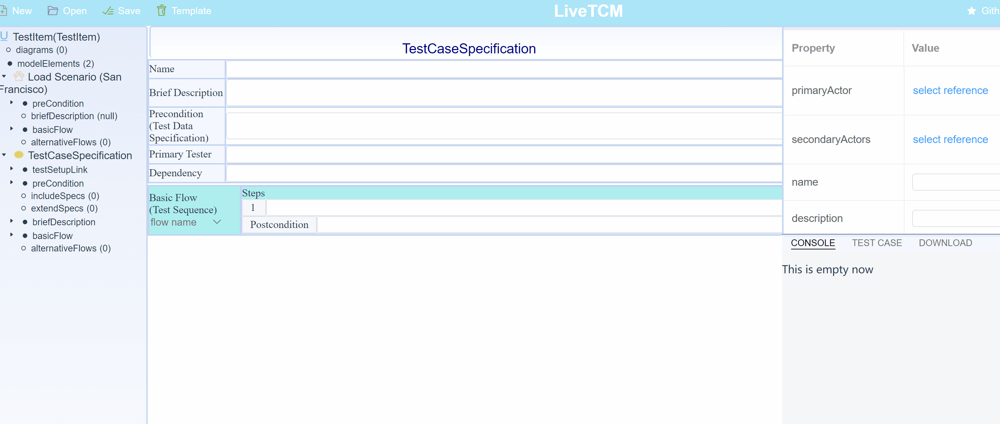
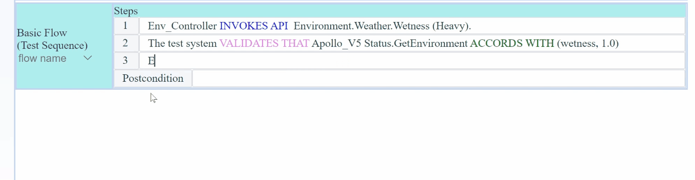
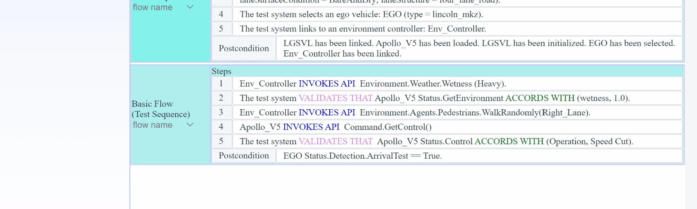

# A Natural Language Guided Adaptive Model-based Testing Tool for Autonomous Driving

Key features:

#### 1. Model Explorer

LiveTCM provides an explorer to create, modify, and delete model elements with a tree structure. 

#### 2. Test setup

Testers can specify the test setup in the Test Setup model view. It should comprise a sequence of steps.

#### 3. TestCaseSpecification

Testers can define test case specifications in natural language and LiveTCM can convert them into model elements during runtime.

#### 4. Auto-Completion for imported APIs

Steps related to APIs can be auto-completed.

#### 5. Alternative Flows

Testers can define various alternative flows, e.g., oracle verification flow, specific verification flow.
The flow can be reused with ``Copy & Paste``.

#### 6. Dynamic generation

LiveTCM has an extensible engine to enable the generation/completion of the test case specification.

#### 7. Record & Replay execution

LiveTCM supports to record & replay a test scenario.

#### 8. Switch Mode & Pause and Stop execution

LiveTCM offers two modes for controlling the execution of the test case specification and aids in debugging by providing options to Pause and Stop.

More details about our approach can be found:
> Y. Shi, C. Lu, M. Zhang, H. Zhang, T. Yue and S. Ali, "Restricted Natural Language and Model-based Adaptive Test Generation for Autonomous Driving," 2021 ACM/IEEE 24th International Conference on Model Driven Engineering Languages and Systems (MODELS), 2021, pp. 101-111, doi: 10.1109/MODELS50736.2021.00019.