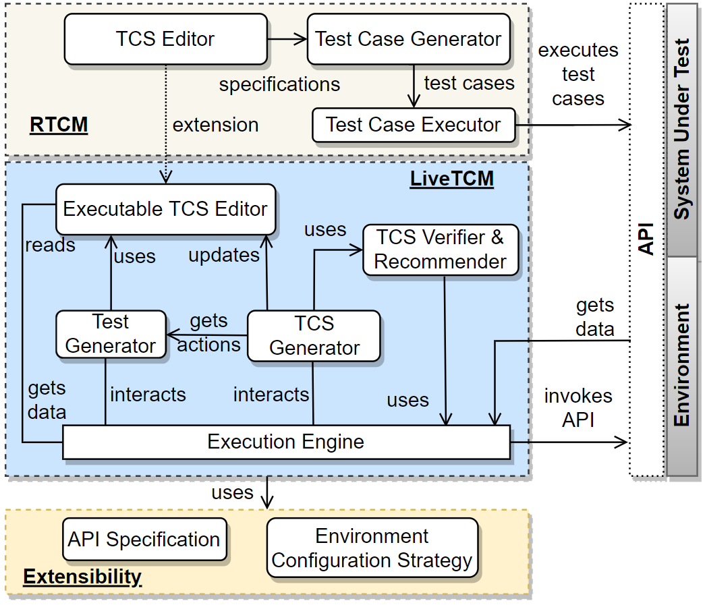

# LiveTCM:  Restricted Natural Language and Model-based Adaptive Test Generation for Autonomous Driving

- [LiveTCM: Restricted Natural Language and Model-based Adaptive Test Generation for Autonomous Driving](#livetcm--a-tool-with-restricted-natural-language-and-model-based-adaptive-test-generation-for-autonomous-driving)
  - [1. Contribution](#1-contribution)
  - [2. Introduction](#2-introduction)
  - [3. Features of LiveTCM Tool](#3-features-of-livetcm-tool)
      - [1. Model Tree](#1-model-tree)
      - [2. TestSetup](#2-testsetup)
      - [3. TestCaseSpecification & Reference](#3-testcasespecification--reference)
      - [4. Auto-Completion](#4-auto-completion)
      - [5. Alternative Flows](#5-alternative-flows)
        - [oracle verification flow](#oracle-verification-flow)
        - [global verification flow](#global-verification-flow)
      - [6. Dynamic generation](#6-dynamic-generation)
      - [7. Reply execution](#7-reply-execution)
      - [8. Switch Mode & Pause and Stop execution](#8-switch-mode--pause-and-stop-execution)

## 1. Contributions
1) We proposed a web-based and executable Test Case Specification (TCS) editor with the features of manually specifying TCSs, displaying generated TCSs and execution logs, and highlighting executing steps at runtime; 
2) We proposed one test generator and one TCS generator, which together with an execution engine, supports five different application contexts, such as step-wise or automatically executing already specified TCSs, and generating TCSs while execution, by interacting with the SUT and its operating environment via plugged-in REST APIs; 
3) We implemented an integrated and extensible framework for supporting automated testing of ADSs.

## 2. Overview

An overview of LiveTCM is shown here. It supports the full life cycle testing of evolving systems. LiveTCM is equipped with two types of TCS editors. One is for manually specifying TCSs (i.e., the TCS Editor) and the other is for dynamically completing TCSs (i.e., the Executable TCS Editor).

## 3. Demonstratin of the LiveTCM Tool

Below, we demonstrate the key features of the LiveTCM tool.

#### 1. Model Tree

LiveTCM provides a model tree to create, modify, and delete model elements. 

#### 2. TestSetup

Testers can specify Test Setup in the Test Setup model view. It should include the basic flow and optionally one or more alternative flows.

#### 3. TestCaseSpecification & Reference

Testers can specify TestCaseSpecification in the TestCaseSpecification model view and refer to an existing test setup, then the view will import the test setup.

#### 4. Auto-Completion

Below, we demo the feature of the auto completion for APIs.

#### 5. Alternative Flows

##### oracle verification flow

Testers can create an oracle verfication flow using the down arrow and make a link to the corresponding step in another flow of events.

##### global verification flow

Global verification flow can be reused wiht the feature of copy and paste.

#### 6. Dynamic generation

LiveTCM automatically generates the basic flow.

#### 7. Reply execution

LiveTCM can replay a test scenario.

#### 8. Switch Mode & Pause and Stop execution

Testers can switch between the dynamic mode and static mode during an execution by right-clicking the beginning of a step. Below, we show the feature of debugging with Pause and Stop.

